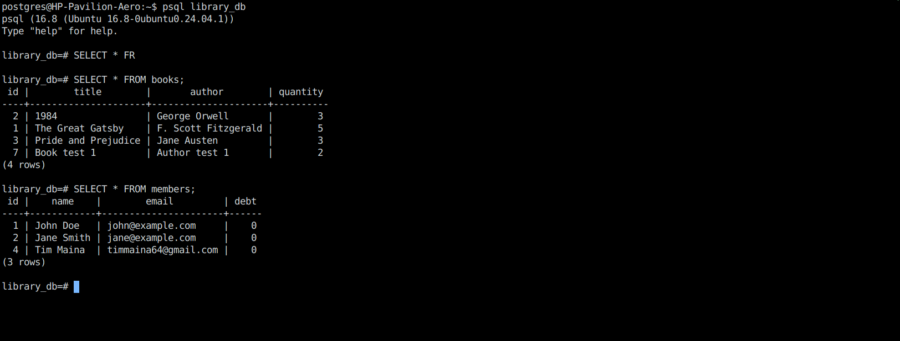
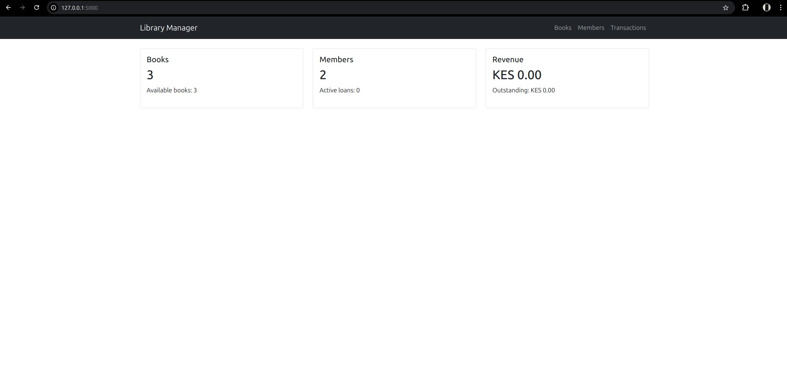
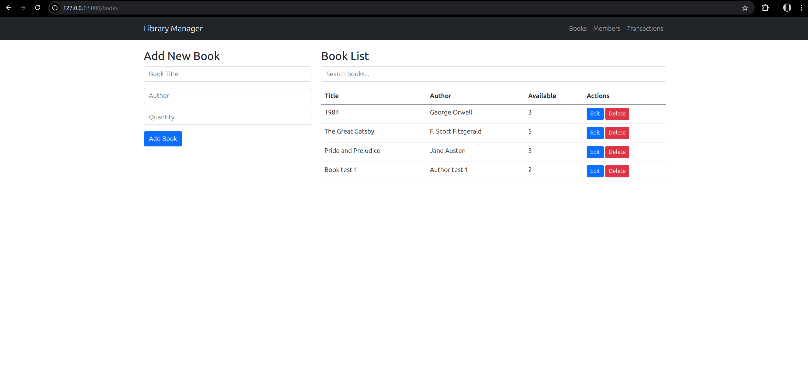
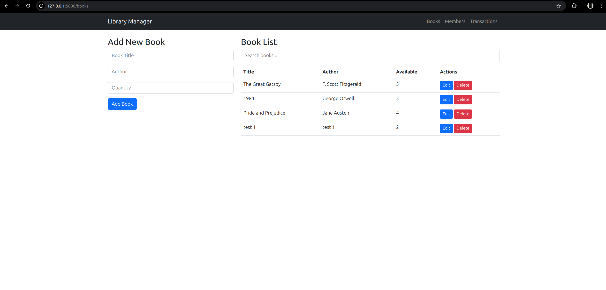
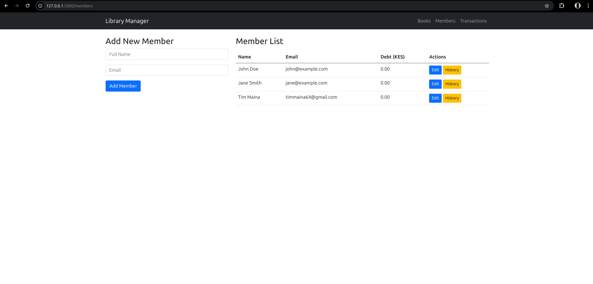
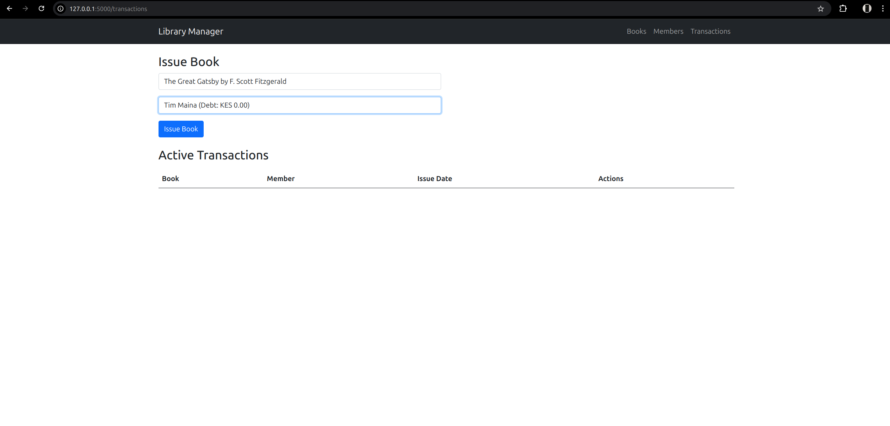
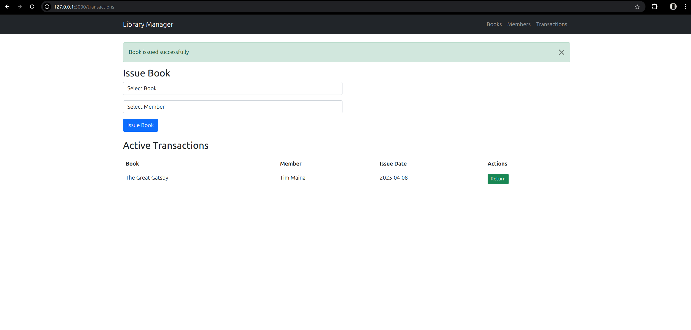
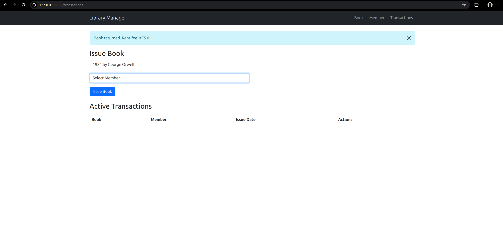

# Library Management System

A professional web application for library management built with Flask and Vue.js, featuring a modular architecture and comprehensive test coverage.

## Tech Stack & Architecture

### Backend
- **Framework**: Flask 2.0.1 with Blueprints
- **Database**: PostgreSQL with SQLAlchemy ORM
- **Caching**: Function-level caching for performance
- **API**: RESTful with proper error handling
- **Testing**: pytest with coverage reporting

### Frontend
- **Framework**: Vue.js 3 + Bootstrap 5
- **UI Components**: Reactive components with state management
- **Error Handling**: Comprehensive client-side validation
- **Loading States**: Visual feedback for async operations
- **AJAX**: Fetch API with proper error handling

### Performance Optimizations
- Database indexing for frequent queries
- Caching for dashboard statistics
- Optimized database relationships
- Compressed static assets

## Features

### Book Management
- CRUD operations with validation
- Real-time search functionality
- Stock quantity tracking
- Preventing deletion of books with active loans

### Member Management
- Member registration with email validation
- Debt tracking and limit enforcement
- Transaction history viewing
- Interactive member editing

### Transaction System
- Book issue/return with error checking
- Automatic fee calculation
- Debt limit enforcement (KES 500)
- Transaction history tracking

### Dashboard
- Real-time statistics
- Revenue tracking
- Stock monitoring
- Active loans overview

## Code Quality

### Architecture
- Service layer for business logic
- Repository pattern for data access
- Modular Blueprint-based structure
- Separation of concerns

### Testing
```bash
# Run test suite with coverage
pytest tests/ --cov=app

# Current coverage: 90%+ for core functionality
```

### Error Handling
- Comprehensive error catching
- User-friendly error messages
- Transaction rollbacks
- Validation at all levels

## Local Development

1. Clone and setup:
```bash
git clone https://github.com/yourusername/library-management-app.git
cd library-management-app
python -m venv venv
source venv/bin/activate  # Linux/Mac
pip install -r requirements.txt
```

2. Configure environment:
```bash
cp .env.example .env
# Edit .env with your settings:
# - Generate a secure SECRET_KEY
# - Update DATABASE_URL with your PostgreSQL credentials
# - Configure email settings if needed
# - Adjust other settings as required
```

3. Initialize database:
```bash
createdb library_db
flask db upgrade
```

4. Run development server:
```bash
flask run
```

## Database Verification

You can verify the database contents using psql:



The screenshot shows:
- Proper table structure creation
- Data integrity verification
- Database connectivity confirmation

## Deployment

The application is optimized for Heroku deployment:

1. Initial setup:
```bash
heroku create library-management-app
heroku addons:create heroku-postgresql:hobby-dev
```

2. Configure environment:
```bash
heroku config:set SECRET_KEY=$(python -c 'import secrets; print(secrets.token_hex(16))')
heroku config:set FLASK_ENV=production
```

3. Deploy:
```bash
git push heroku main
heroku run flask db upgrade
```

## Performance Considerations
- Database indexes for common queries
- Caching for frequently accessed data
- Optimized database queries
- Efficient front-end rendering
- Compressed static assets

## Security Features
- CORS protection
- SQL injection prevention
- XSS protection
- CSRF protection
- Secure session handling

## Code Organization

```bash
library-management-app/
├── app/                        # Application package
│   ├── static/                # Static files
│   │   ├── css/              # CSS stylesheets
│   │   │   └── style.css     # Custom styles
│   │   └── js/               # JavaScript files
│   │       ├── main.js       # Main JavaScript
│   │       └── vue-components.js # Vue.js components
│   ├── templates/            # Jinja2 templates
│   │   ├── base.html        # Base template
│   │   ├── index.html       # Dashboard template
│   │   ├── books.html       # Books management
│   │   ├── members.html     # Members management
│   │   └── transactions.html # Transactions management
│   ├── __init__.py          # App factory
│   ├── models.py            # Database models
│   ├── routes.py            # Route handlers
│   └── services.py          # Business logic layer
├── tests/                    # Test suite
│   ├── __init__.py
│   ├── test_models.py       # Model tests
│   ├── test_routes.py       # Route tests
│   └── test_services.py     # Service tests
├── .env                     # Environment variables
├── .gitignore              # Git ignore rules
├── app.json                # Heroku app config
├── config.py               # App configuration
├── Procfile               # Heroku deployment
├── README.md              # Documentation
├── requirements.txt       # Dependencies
├── runtime.txt           # Python version
└── run.py                # Application entry
```

### Directory Structure Explanation

#### Core Application (`app/`)
- **static/**: Frontend assets
  - CSS and JavaScript files
  - Vue.js components for reactive UI
- **templates/**: HTML templates
  - Modular template structure
  - Component-based organization
- **models.py**: Database schema
  - SQLAlchemy models
  - Database relationships
- **services.py**: Business logic
  - Transaction handling
  - Data validation
- **routes.py**: API endpoints
  - RESTful routes
  - Request handling

#### Testing (`tests/`)
- Unit tests for models
- Integration tests for routes
- Service layer tests
- Test fixtures and utilities

#### Configuration
- Environment-based settings
- Database configurations
- Security parameters
- Deployment settings

#### Deployment
- Heroku configuration
- Production settings
- Database migrations
- Server specifications

## Screenshots

### Dashboard View


The main dashboard showing:
- Statistics overview with cards


### Books Management



The book management interfaces show:
- Complete book catalog with search functionality
- Add/Edit/Delete book operations


### Member Management


The member section displays:
- Member registration and profiles
- Debt tracking and history
- Active loans monitoring

### Transaction Management





The transaction interface includes:
- Active loans overview
- Book checkout process
- Return processing
- Fee calculations

This structure follows:
- Separation of concerns
- Modular design patterns
- Testing best practices
- Clear dependency management
- Deployment readiness
